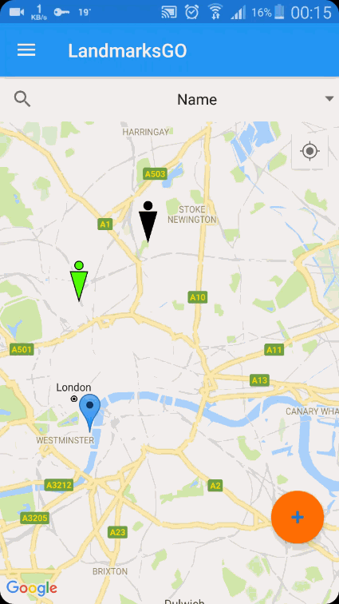
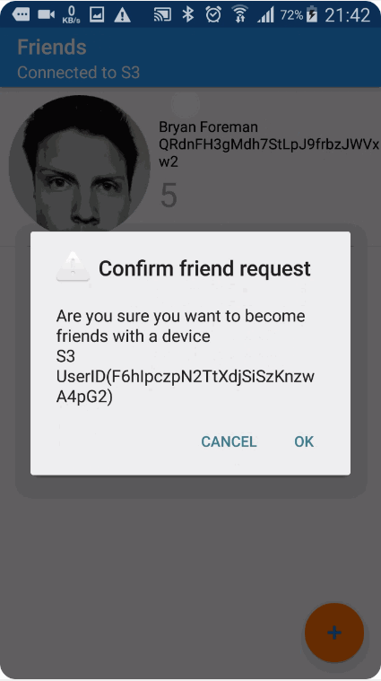
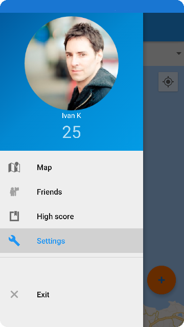
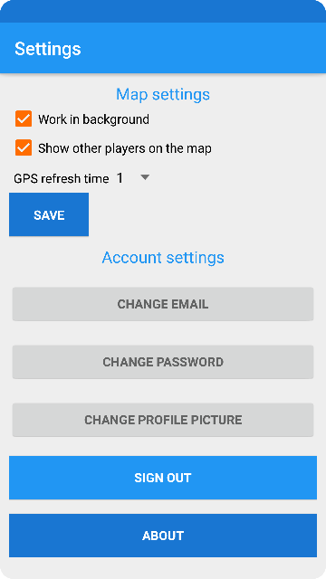
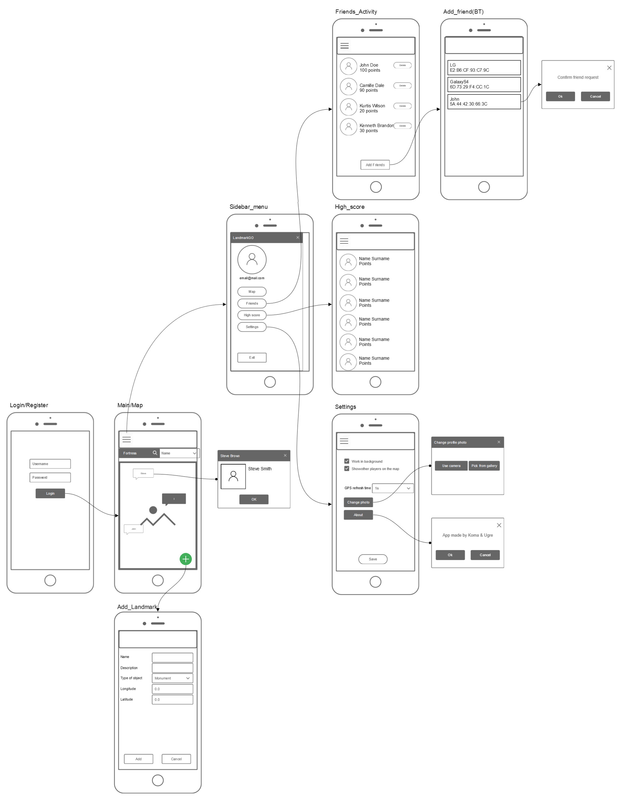

LandmarksGO
===========

### LandmarksGO is a location based app for Android devices. Firebase is used as a real-time database, for storing images and for handling authentication. LandmarksGO has:

-   User registration, login and changing user data

-   Adding friends via Bluetooth

-   Realtime updates to all devices- users locations, scores, profile photos,
    friends lists

-   Adding landmarks

-   Searching landmarks (by name, distance, category)

-   Highscore table

-   Background service for updating user's location and getting notifications
    about nearby friends and landmarks

[Full-size mockup](https://realtimeboard.com/app/board/o9J_k0Cdrec=/)